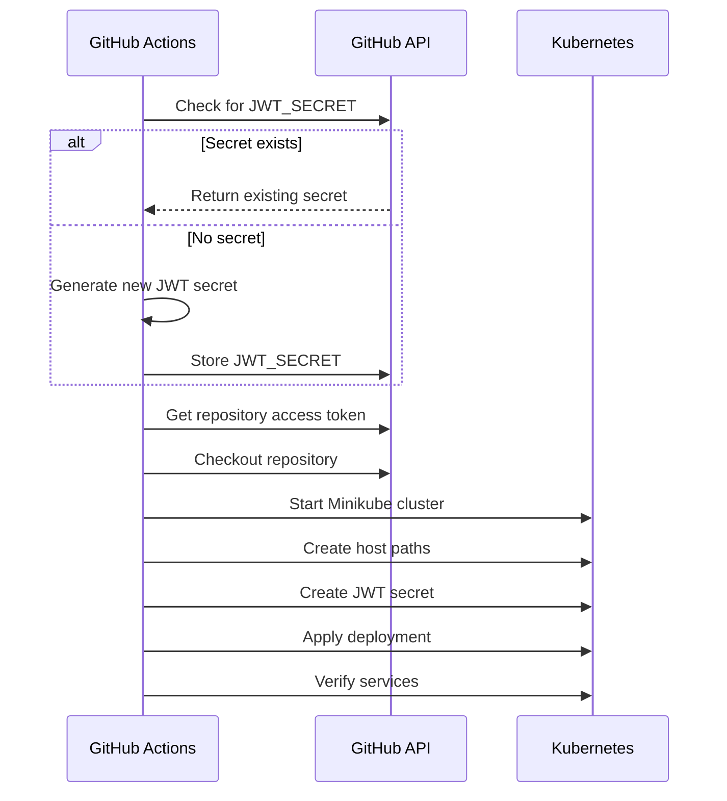

## What this is

This project provides a Kubernetes deployment for running an Ethereum consensus and execution client stack using Geth (Go Ethereum) and Prysm. It enables you to easily set up, manage, and monitor an Ethereum node cluster on Kubernetes.

## Prerequisites

- [kubectl](https://kubernetes.io/docs/tasks/tools/)
- [minikube](https://minikube.sigs.k8s.io/docs/) or another Kubernetes cluster
- [Helm](https://helm.sh/) (optional, if using Helm charts)
- Docker (for building images, if needed)

## Setup Instructions

1. **Generate JWT Secret**  
    Generate a JWT secret for secure communication between Geth and Prysm:
    ```sh
    openssl rand -hex 32 > jwt.hex
    ```

2. **Deploy the Stack**  
    Run the deployment script:
    ```sh
    ./deploy.sh
    ```

3. **Monitor the Deployment**  
    Check pod status:
    ```sh
    kubectl get pods
    ```
    View logs:
    ```sh
    kubectl logs <pod-name>
    ```

